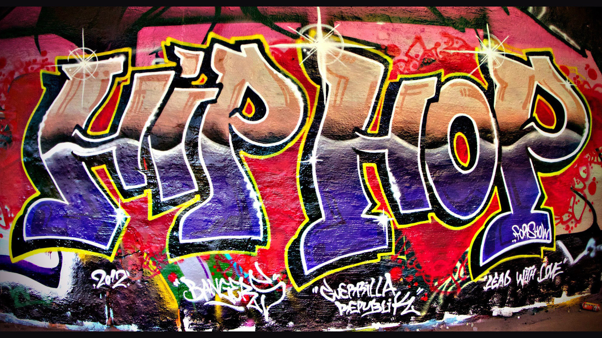

# MUS-17-Hip-Hop-SP24-UCSD
Archive of Course Materials for MUS 17 Hip-Hop, a course I instructed at UC San Diego, Spring Quarter, 2024

Course YouTube Channel: [https://www.youtube.com/@MUS17Hip-HopUCSD](https://www.youtube.com/@MUS17Hip-HopUCSD)

Selected Teaching: [MUS 17 Hip-Hop Lectures](https://www.youtube.com/playlist?list=PLnYrdeC2961sRQ74wnqjgVd57qNeOUGX0)

Guest Speakers: [Guest Lecture with MC Ric Scales, DJ Inform, and Hip-Hop dancer STAMPEDE](https://www.youtube.com/playlist?list=PLnYrdeC2961vqLgma4lSAbqfOEDQU-gwY)

Selected Projects: [MUS 17 Projects](https://www.youtube.com/playlist?list=PLnYrdeC2961uTb5HmsoeTP2GwcC3vBZgt)

